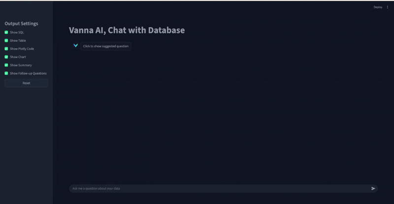

# Vanna chatwithDB

A data analysis system powered by Vanna AI, enabling natural language queries on Steam game databases.

## 📺 Demo



## 📋 Overview

This is a Steam game data analysis tool built with the Vanna AI framework, capable of generating SQL queries from natural language and analyzing game data.

## 🚀 Features

- Natural language to SQL query generation
- Steam game data analysis
- Vector database storage (Milvus + BGE model)
- Interactive query interface

## 📦 Installation

**1. Environment Setup**

Choose one of the following options:

```bash
# Option 1: Using venv
python3 -m venv venv
source venv/bin/activate  # On Windows: venv\Scripts\activate

# Option 2: Using conda
conda create -n vanna_env python=3.10  # Python >= 3.8 required
conda activate vanna_env
```

**2. Install Dependencies**

```bash
pip install -r requirements.txt
```

## 🎮 Usage

Follow these steps to run the application:

```bash
# Step 1: Configure database and populate with Steam data
python utils/create_and_populate_sqlite.py

# Step 2: Train Vanna to learn database schema and relationships
python utils/Config_vanna_VectorDB.py

# Step 3: Launch the Streamlit application
streamlit run app.py
```

## 📊 Dataset

The project uses Steam game data, including:
- **games.csv** - Game information (title, release date, ratings, etc.)
- **categories.csv** - Game category mappings
- **tags.csv** - User-generated tags for games

## 🛠️ Tech Stack

- Python
- Vanna AI
- SQLite
- Milvus Vector Database
- BGE Embedding Model

## 📁 Project Structure
SteamVannaAnalytics/
├── app.py # Main Streamlit application
├── vannacalls.py # Vanna API calls
├── requirements.txt # Python dependencies
├── data/
│ ├── db/
│ │ ├── milvus_BGE.db # Vector database
│ │ └── steam_data.db # SQLite database
│ └── processed_dataset/
│ ├── games.csv # Game data
│ ├── categories.csv # Category data
│ └── tags.csv # Tag data
└── utils/
├── Config_vanna_VectorDB.py # Vanna training & configuration
├── create_and_populate_sqlite.py # Database initialization
└── process_kaggle_dataset.py # Dataset preprocessing


## 🔧 Configuration
You can retrain Vanna with custom settings by modifying the configuration in `utils/Config_vanna_VectorDB.py`. This allows you to:
- Adjust the vector database parameters
- Fine-tune the embedding model
- Add custom training data (DDL, documentation, SQL examples).